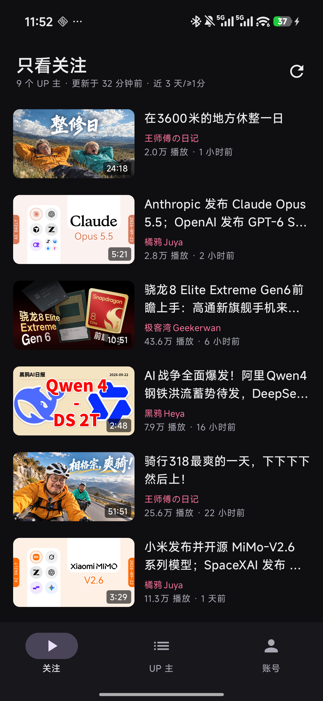
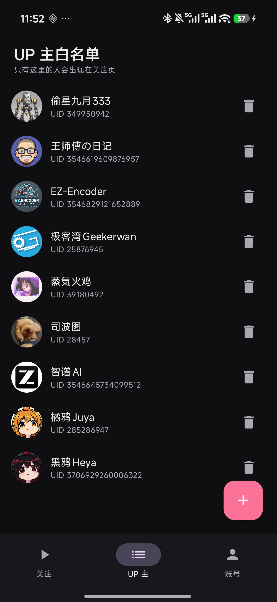
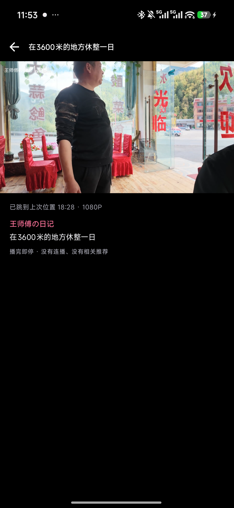
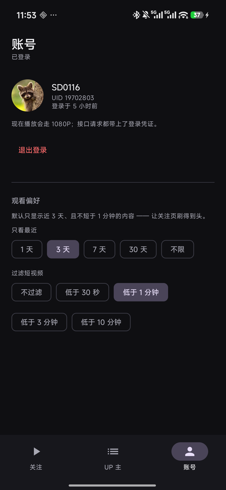

<div align="center">


# SeeLess

**只看你亲手挑的那几个 UP 主。推荐流不是被屏蔽了 —— 是这个 app 里根本没有。**

[](https://github.com/logan0116/Bfilter/actions/workflows/build.yml)
[](LICENSE)


<sub>仓库目录名是 `Bfilter`（历史名称），应用显示名是 SeeLess。</sub>

</div>

---

## 它解决什么问题

卸载 B 站能挡住推荐流，但想看关注的内容时又得装回来 —— 装回来就又被推荐流抓住。这是个死循环。

SeeLess 走另一条路：**不屏蔽，换数据源**。

它的信息流完全由你手动加入白名单的 UP 主组装而成，推荐位在**数据层**就不存在 ——
不是被藏起来、不是被 CSS 盖住、不是靠 hook 拦截，而是这个 app 从来不请求那些接口。

**这条流是会被刷到头的。** 打开发现没有更新是预期状态，不是加载失败 —— 这是它和你手机里其他视频 App 最大的区别。

| | |
|---|---|
|  |  |
| 主页就是你选的 UP 主的更新，按时间混排 | 白名单：搜昵称或直接填 UID |
|  |  |
| 播完即停 —— 没有连播、没有"相关推荐" | 登录之后 480P → 1080P |

## 功能

- **唯一的一条流** —— 主页只有白名单 UP 主的更新，没有推荐、热搜、直播入口
- **白名单管理** —— 搜索昵称添加，或直接填 UID（新账号 UID 有 16 位，也支持）
- **内置播放器** —— 双击暂停/播放、长按 1× ↔ 2× 倍速、全屏、断点续播（播完即停，没有下一个视频）
- **息屏继续听** —— 播放期间持有网络锁并以前台服务保活，锁屏后不断流；断网按 1s→30s 指数退避自动重连。通知栏会有一条「正在播放」
- **登录** —— 扫码或粘贴 `SESSDATA`，换来 1080P 与更宽松的接口频率限制
- **拉一次存一次** —— 启动只读本地缓存、不联网；断网时旧内容照常看，错误提示合并成一条
- **不依赖 root** —— 普通应用，不需要 LSPosed、不需要无障碍服务

## 验证范围

**下面这些边界请先看** —— 全部结论来自真机实测，但实测只覆盖了两台机器。

| 项 | 情况 |
| --- | --- |
| 实测设备 1 | 红米 K80 至尊版（`25060RK16C`）· Android 16 / HyperOS 3.0 |
| 实测设备 2 | Mi MIX 2S · Android 15 / LineageOS 22.2 |
| 声明的 `minSdk` | 24（Android 7.0）—— **但 Android 7–14 没有实机验证过**，只是编译能通过 |
| 静态检查 | `lintRelease` 0 errors（25 条 warning 均为有意保留：24 条"依赖有新版本"、1 条手势相关） |
| 单元测试 | 11/11 |

**未验证的场景**（这些是已知的空白，不是"应该没问题"）：

- 移动中的长播放（骑行/通勤路上切基站、进隧道、弱网抖动）—— 息屏播放只在**静止**状态下测过
- 单次 1 小时以上的连续播放
- 系统低电量模式下的表现
- 平板 / 大字体 / 深色主题切换
- 白名单超过 15 个 UP 时的接口频率表现

详细的逐项测试记录见 [`TESTING.md`](TESTING.md)。

## 构建

需要 **JDK 17** 和 **Android SDK**（`compileSdk 35`）。

```bash
git clone https://github.com/logan0116/Bfilter.git
cd Bfilter

./gradlew :app:assembleDebug
# 产物：app/build/outputs/apk/debug/app-debug.apk

./gradlew :app:testDebugUnitTest   # 11 个单元测试
./gradlew :app:lintRelease         # 静态检查（当前 0 errors）
```

想要**正式签名**的 release 包，在工程根目录建 `keystore.properties`（已在 `.gitignore` 里，不会进版本库）：

```properties
storeFile=keystore/release.jks
storePassword=你的口令
keyAlias=你的别名
keyPassword=你的口令
```

> 不想自己编译：GitHub Actions 每次 push 会自动出 debug 包，在 **Actions** 页面下 artifact 即可。

## 发布新版本

正式签名的 release 包由 GitHub Actions 在**打 tag 时**自动构建并发布 ——
签名材料放在仓库 Secrets 里，不进代码库。

**首次配置（只需一次）：**

1. 把 keystore 导出成单行 base64：

   ```bash
   base64 -w0 keystore/release.jks
   ```

2. 到仓库 **Settings → Secrets and variables → Actions** 添加四个 secret：

   | Secret | 值 |
   | --- | --- |
   | `KEYSTORE_BASE64` | 上一步输出的整行 base64 |
   | `KEYSTORE_PASSWORD` | `keystore.properties` 里的 `storePassword` |
   | `KEY_ALIAS` | `keystore.properties` 里的 `keyAlias` |
   | `KEY_PASSWORD` | `keystore.properties` 里的 `keyPassword` |

3. 在 `.github/release-notes/<tag>.md` 写好发布说明（CI 优先读它，缺失才回退到 tag 说明），
   递增 `app/build.gradle.kts` 里的 `versionCode` / `versionName`，然后打 tag：

   ```bash
   git tag -a v0.4 -m "v0.4 ..."
   git push origin v0.4
   ```

CI 会自动跑 lint + 单测 → 构建签名包 → 用 `apksigner` 校验签名 → 创建 Release 并附上 APK。
**签名一致**，所以已装旧版的手机会正常收到升级。

> 为什么发布说明要放仓库文件而不是 tag 说明：`git tag -l --format='%(contents)'` 在本地能拿到，
> 在 CI 的浅克隆工作区里拿到的是空 —— 而空值会 fallback 成 commit message，
> 结果 Release 正文写成一条 commit log（v0.1 第一次发布就是这么翻车的）。

> 安全说明：Secrets 在传输和存储时都是加密的，Pull Request 触发的 workflow 拿不到它们
> （fork PR 不授予 secrets）。但 keystore 一旦泄露就等于别人能签你的包 —— 请确保仓库
> 只有你自己有写权限，并且别把 keystore 直接提交进代码。

## 技术笔记：这个仓库最值钱的部分

下面每条都是**实测结论**，不是照文档抄的。做同类项目的话可以直接省掉这些弯路。

### 1. `x/space/arc/search`（空间投稿）对游客是封死的

拿某个 UP 主的投稿列表，最直觉的接口是这个。但游客态下它长期返回
`HTTP 412 request was banned`，wbi 版同理。

**改用 UP 主动态流** `x/polymer/web-dynamic/v1/feed/space`（需 wbi 签名）：
一次请求就能拿到该 UP 的全部最新动态，里面天然包含视频投稿（`DYNAMIC_TYPE_AV`）。
实测 7 个 UP 串行拉取（间隔 1.6s）全部成功。

### 2. 顺序反转实验：我差点写错两版代码

排查 412 时我做了一组对照实验，结论看起来非常硬：

> 不带额外参数 → 成功；带 `order` / `platform` / `web_location` → 全部 412

于是我得出「参数导致风控」的结论，并据此改了两版代码。

后来把**成功那组挪到后面**再测一次，结论立刻反转 —— 原来只是「每轮第一个请求恰好能过」。

**凡 B 站风控类结论，必须做顺序反转实验（把"成功"的变体放到后面重测）才能采信。**

### 3. 软限流：`code: 0` 但列表是空的

动态流被限流时**不报错**，而是返回 `code: 0` + 空 `items` ——
看起来和「这个 UP 主没发新东西」一模一样。

对策：**空结果绝不覆盖缓存**，退回上次内容并如实提示：

```
偷星九月333、司波图、极客湾Geekerwan 等 7 个：网络不可用
这次没拉到新内容，显示的是 2 分钟前的缓存
```

### 4. wbi 签名里最容易错的一行

参数值的百分号编码必须对齐 Python 的 `quote_plus`（放行 `A-Za-z0-9_.-~`，空格转 `+`）。
用 `java.net.URLEncoder` 会不一致 —— 它放行 `*` 却编码 `~`，算出来的 `w_rid` 对不上，
服务端只会甩你一句 `-352 风控校验失败`。见 `Wbi.kt`，有单测锚定 Python 侧的黄金值。

### 5. 手机端扫码登录有个物理限制

扫码登录的经典场景是「二维码在电脑上、手机来扫」。但在手机 app 里，
**二维码和哔哩哔哩 App 在同一块屏幕上，用户没法自己扫自己**。

两条路都实现了：存二维码到相册（`MediaStore`，Android 10+ 免权限）后从 B站 App 的
「扫一扫 → 相册」选它；或者直接粘贴 `SESSDATA`。另外 B 站二维码只有约 3 分钟寿命，
过期要自动换码，否则用户还在找扫一扫时就失效了。

> 开发期间还写了个 `tools/qr_bridge.py`：把手机上的二维码持续同步到电脑屏幕上，
> 这样扫码和确认都方便。它同时也是个可复用的教训 ——
> 二维码**失效后 `ImageView` 仍留在界面上**，所以判断「失效」必须放在「取二维码坐标」之前，
> 否则会对着死码无限空转。

### 6. 息屏播放需要**两个**独立条件，缺一不可

只做其中一个都不够，因为它们在拦两件不同的事：

| 机制 | 拦的是什么 | 对策 |
| --- | --- | --- |
| Wi-Fi 省电 + CPU 浅睡 | 屏幕一关，芯片进低功耗，下一段分片请求建不起连接 | `ExoPlayer.setWakeMode(WAKE_MODE_NETWORK)` —— 播放期间持有 `WifiLock` + `PARTIAL_WAKE_LOCK` |
| 后台进程网络限制 | 非前台进程会被系统与 ROM 限制网络 | 播放期间起 `foregroundServiceType="mediaPlayback"` 的前台服务，让进程不掉成 cached |

**判断根因的一个有用信号**：如果日志里是 `ERROR_CODE_IO_NETWORK_CONNECTION_FAILED`，
说明**进程还活着、还在发请求**，只是连接建不起来 —— 那就不是"进程被杀"，别往保活方向查。
进程真被冻结时表现是**直接没声音**，而不是报网络错误。

顺带一个与直觉相反的实测结论：**Android 16 上自建 `mediaPlayback` 前台服务不需要配 `MediaSession`**。
声明 service + 四个权限即可（`WAKE_LOCK`、`FOREGROUND_SERVICE`、`FOREGROUND_SERVICE_MEDIA_PLAYBACK`、
`POST_NOTIFICATIONS`），`isForeground=true types=0x00000002` 正常。这省掉了把播放器搬进
`MediaSessionService` 的整套跨进程重构。

### 7. media3 的 API 不要凭记忆写

`media3 1.4.1` 里这几处和"想当然"不一样，每一处都让编译直接失败：

| 你以为 | 实际 |
| --- | --- |
| `androidx.media3.exoplayer.LoadErrorHandlingPolicy` | 在 **`.upstream`** 子包下 |
| `ExoPlayer.Builder.setLoadErrorHandlingPolicy(...)` | 该方法在 **MediaSource 工厂**上，Builder 里没有 |
| 实现 `LoadErrorHandlingPolicy` 接口只覆写两个方法 | 1.4.1 里还得实现 `getFallbackSelectionFor`，不值得 —— 直接用 `DefaultLoadErrorHandlingPolicy(n)` |
| `PlaybackException.errorCause` | 1.4.1 里叫 **`cause`**（`errorCause` 是 1.5+） |

笨但这台机器上可行的核实办法：从 aar 里解出 `classes.jar`，用 `strings` 读 class 常量池看方法名和字段名。

### 8. 「点了没反应」先怀疑注入权限，再怀疑 App

在小米设备上做 adb UI 自动化，`input tap / keyevent / swipe` 会抛
`SecurityException: Injecting input events requires ... INJECT_EVENTS permission`，
而**界面毫无反应** —— 症状和"App 的按钮坏了"一模一样。需要在开发者选项里额外打开
「USB 调试（安全设置）」（要求插 SIM 卡 + 登录小米账号），开完可能还要重插一次 USB 线。

两个附带的坑：

- **无副作用的探测命令**：`input keyevent 0`（键码 0 无效）。有权限时静默通过，无权限时抛异常。
  探针判据要写成**正向确认** —— 用"输出里没有 INJECT_EVENTS 就算放行"，会在设备掉线时
  把 `adb: no devices/emulators found` 误判成已放行。
- **`input tap` 有时触发不了 Compose 的点击**，尤其 FloatingActionButton。改用
  `input swipe x y x y 150`（原地按住 150ms）即可。

## 隐私

- 登录凭证（`SESSDATA` 等）**只写在本机 DataStore、只出现在请求头里**
- 不写日志、不上报、没有导出入口；账号页可一键退出并清除
- 应用不收集任何数据、没有第三方 SDK、没有广告
- 全部网络请求只发往 `*.bilibili.com` 与视频 CDN

## 免责声明

- 这是**非官方**客户端，与哔哩哔哩（bilibili）无任何关联
- 不提供、不托管任何内容；所有数据均来自 B 站公开接口，版权归原作者所有
- 仅供学习与个人使用，请遵守 B 站用户协议；请勿用于商业用途或大规模抓取
- 接口随时可能变动，使用风险自负

## License

[MIT](LICENSE) © 2026 logan0116
